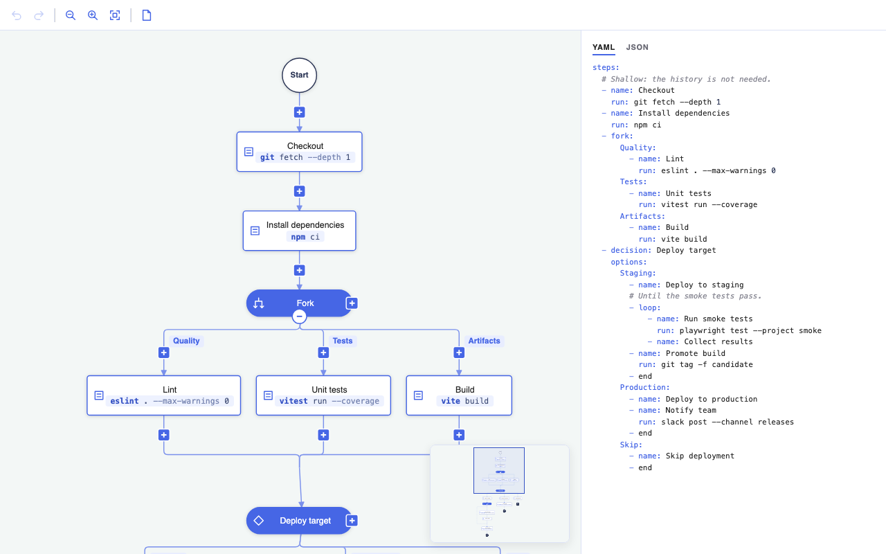

# JointJS+: CI Pipeline Editor (TypeScript) <a href="https://www.jointjs.com/jointjs-plus"></a>

An editor of a CI/CD pipeline, built with JointJS+: a tree laid out by `layout.TreeLayout` in which a node can be a *group*: a container with a start node, some content and an end node. A *fork group* holds branches - any number of them - that converge into the end node — a fork/join. A *loop group* holds a tree that grows down on the right and a return link that climbs back up on the left, from the end node to the start node — a loop. The tree connects to a group as a single node, so subgraphs that a tree layout cannot handle on its own fit into the tree. Groups nest and collapse.



## Features

- **The data is the source of truth** -- the diagram is a flat map of nodes by id (`data/types.ts`): a `start`, `step`s and `decision`s with a label, `fork`s and `loop`s with their `branches`, `end`s; every node but an end lists what it leads `to`, an edge per child, named where the child is an option. Held by `DiagramData`, an `mvc.Model` with one attribute per node, and translated into the graph by `buildGraph()` (`data/build.ts`) after every edit: an element per node, and everything the structure implies -- the gates and the inner links of a group, the return link of a loop, the link from every leaf inside a group to the end of the group, the add button below every leaf outside -- under fixed ids, so that `graph.syncCells()` updates the cells that stand for the same thing and adds or removes the rest. The layout then runs on the graph as before. The pattern of the [guided, layout-driven editing](https://docs.jointjs.com/learn/release-notes/4.2.0#guided-layout-driven-diagram-editing) of JointJS 4.2, in its simplest form.
- **Undo and redo** -- every edit changes the data only, as one batch; a `dia.CommandManager` on the data model records it, and `Ctrl+Z` / `Ctrl+Shift+Z` (`⌘Z` / `⇧⌘Z`, `ui.Keyboard`) or the toolbar set the data back, step by step. The graph is rebuilt on every push, undo and redo of the history.
- **Toolbar** -- a `ui.Toolbar` above the paper with the built-in `undo` and `redo` widgets, disabled while there is nothing to undo or redo (`autoToggle`, driven by the command manager), the `zoomOut` and `zoomIn` widgets, driven by the scroller, a "zoom to fit" that fits what is visible, and a clear that leaves the start alone - one edit of the data, undoable like any other. The widgets are drawn with the icons of this demo instead of the text of the default theme: a rule in the stylesheet masks each button with a glyph.
- **Selection and inspector** -- a click selects an element (`ui.Selection`, one at a time, no dragging: the layout owns the positions) - a step, a decision, the start of a group, the start or an end of the diagram - outlined by a frame (`ui.HighlighterSelectionFrameList` with `FrameHighlighter` from `frame.ts`, a `highlighters.stroke` that draws the frame from the model at an even distance instead of scaling the outline, which turns the round ends of a pill elliptical), drawn in the back layer of the paper, behind the links and the buttons, in the shape of the element - the corners of a step, the round ends of the other pills, the circle of a terminal; a click on the blank area or `Escape` clears the selection. The selected element opens in the inspector on the right: a `ui.Inspector` bound to the data model, not to the cell - its inputs edit the fields of the node the element stands for, under the path `<id>/<field>`: the `label` of a step or a decision, and the names of the options of a decision or the branches of a fork - one input per option, bound to the `name` of the edge in the parent's list (`<id>/to/<index>/name`; the start of a fork stands for the fork, `branches`). An option added or removed adds or removes its input. The start and the ends of the diagram have nothing to edit; a loop, its comment. A change is one edit of the data like any other: recorded by the history, undoable, followed by a rebuild of the graph. An element that an edit removes or hides (a collapsed loop) leaves the selection.
- **Pills sized to their labels** -- a step or a decision is as wide as its label needs (`setPillLabel()` in `shapes/pill.ts`: the text is measured with the 2D context of an off-screen canvas, `measureText()`, in the font of the labels) and as tall as its lines - a newline in the label breaks a line - with the size of a node as the minimum. The label is edited in a text area of the inspector, so it can span lines; the layout takes the sizes as they are. The command a step runs (`run`) goes below the label as code - monospaced, smaller and tinted through an annotation of the `text` attribute - and is measured in that font.
- **Groups in a tree** -- a group is one node of the tree: the outer links connect to the group element, not to the start and end nodes inside it. The group hugs its content, from the top of its start node to the bottom of its end node, but it is never rendered: the paper's `cellVisibility` hides it, so it is a node of the layout only. A custom anchor puts the outer links on the axis of the two gates, and the tree layout's vertices are computed on that axis too -- the tree connects to the start and end nodes, as far as the eye can tell, even when the content is wider on one side of them.
- **Bottom-up layout** -- every group is laid out on its own with `treeLayout.layoutTree(start)`, then sized from its start to its end node, the deepest groups first. The outer tree is laid out last, once the size of every group is known.
- **Fork groups: converging branches** -- the tree layout only knows trees, so the end node is excluded from the layout of a group with the `filter` option. It is then placed below the branches and joined to them by a horizontal bar that mirrors the vertices the tree layout draws below a parent.
- **Loop groups: a tree and a way back** -- the tree grows down from the start node and its leaves converge into the end node; the end node links straight back to the start node, up the left side of the group. Nothing can be added to that return link: a node there would run once per iteration exactly like a node of the tree, so the link is the one link without an insert button. It is dashed, as it runs against the flow of the tree.
- **Nested, collapsible groups** -- a node of a branch, or of the tree of a loop, can be a group itself, of either kind. The start node of a group carries the group's collapse button on its bottom edge, a part of its markup, always shown, in inverted colors; the start of a fork also carries, at its right end, the `+` that adds a branch -- a fork may have any number of them; it shows once the fork has one, an empty fork gets its first branch through the insert button of the link from its start to its end. Hovering the collapse button outlines what it would hide in a light blue - the outlines, the fills of the pills and the lines, the way the deletion preview turns them red and a move turns them teal: the three previews differ by their color only (no opacity, which adds up where links overlap). A collapsed group shrinks to the size of a node and hides its content (the `cellVisibility` option of the paper) - the hidden cells stay in the graph, parked at the position of the group (`parkHiddenContent()` in `layout/index.ts`, a workaround: the scroller and the map measure the content by the model, every cell, hidden or not - [joint-plus#836](https://github.com/clientIO/joint-plus/issues/836)); its start node (labelled `Fork` or `Loop`, the kind of the group) stays in its place and stands in for it -- the tree is laid out again around it, and what is added below that node continues the tree below the group.
- **Start and end** -- the root of the diagram is a white circle with a dark outline, labelled `Start`. A dark `End` circle (red is kept for the deletion preview) is an end of the diagram: a leaf nothing can follow, with no add button below it. It can be added below any leaf and as an option of a decision, outside of a group only -- inside a fork or a loop every leaf has to reach the end of the group.
- **Decisions** -- a node that branches out without a merge: a pill labelled `Decision` with a diamond and, once it has a child, a square `+` at its right end -- apart from the `+` of the links, which add below -- that adds a sibling option (the same menu). With no child a decision is a leaf like any other, with the add button below it. A decision may have any number of children; a plain node continues in one child only, so a decision is where a tree splits for good, where a fork splits and joins again. Deleting a decision deletes everything below it, down to the end of its group. A plain node with several children can only be deleted below a decision or a gate, which can take them all.
- **Named options** -- the links from a decision or from the start of a fork to their children carry a label above the insert button: the `name` of the edge in the data, or, unnamed, `option 1`, `option 2`, ... below a decision and `branch 1`, `branch 2`, ... below a fork - the same names the YAML uses as keys (`nameOptions()` in `layout/index.ts`, after every layout; `getDefaultOptionName()` in `data/diagram-data.ts`). The link to an add button is never an option. Those children get the `offset` attribute of the tree layout, which places them further from their parent than the parent gap alone, so that the vertical part of the link has room for the name (the children of a collapsed group get the same room, those of a loop's start node a little more and those of a loop half of it, which keeps the insert button of their link clear of the collapse button above, or of the return link leaving and joining the link); the bar between them lies a third of the gap below the parent, whatever the offset.
- **Pan and zoom** -- the paper sits in a `ui.PaperScroller` that grows with the content. Drag the blank area to pan (`blank:pointerdown` → `startPanning()`), pan with two fingers on a trackpad (`paper:pan`), pinch or `Ctrl` + wheel to zoom (`paper:pinch` → `zoom()` around the pointer). The first layout fits the width of the content into the view, with a margin and no closer than 1:1, and puts the start at the top: the flow is read by scrolling down (a new diagram is fitted the same way); the toolbar's *Zoom to fit* fits the whole diagram into the view, centered (`zoomToRect()` on the visible content, no closer than 1:1 either); the layouts after an edit keep the zoom and the scroll position.
- **Moving a branch** -- *Move to…* in the menu of an element starts a move of the element with everything below it - hovering the item already outlines what would move in teal - the subtree stays outlined, and the drop points of the diagram - the buttons of the links, the add buttons below the leaves, the `+` of a decision or a fork - take the subtree instead of adding a new node, and turn teal, the color of the drop points; `Escape` or a click on the blank area cancels. The points that cannot take it are hidden - the buttons of the links and the add buttons alike: everything inside the subtree itself, a link when the subtree has more than one leaf the flow can continue from (the former target of the link has to follow one), and any point inside a fork or a loop when the subtree reaches an end of the diagram. The data moves the edge - `moveNode()` - so an option keeps its name. With nowhere to go, the item is greyed out.
- **YAML and JSON** -- with nothing selected, the panel shows the diagram as text, on two tabs: as YAML (`data/yaml.ts`, a small emitter of its own): the flow from the start as a sequence of steps - `name` and, for a step that runs a command, `run` - a `fork` as a map of its branches by name, a `decision` with a map of its `options`, a `loop` with its body, and `end` where a path ends; the comment of a node above it, as a YAML comment. The second tab is the data itself, as JSON. Both highlighted by [highlight.js](https://highlightjs.org/) (its core and the YAML and JSON grammars only), themed in the colors of the diagram. Kept up to date with every edit.
- **Map** -- a `ui.Navigator`, small, floating over the bottom right corner of the paper, renders the graph again (`navigator.ts`) with the default views: the elements as they are, small, and the links, but not the add buttons, too small to read on the map. It hides the content of the collapsed groups like the paper does: its paper gets the same `cellVisibility` (and `viewManagement` - without it a paper runs in its legacy mode and calls `cellVisibility` with the view instead of the cell), and is told to check the visibility after every build. It fits the content measured by the model, like the scroller sizes the paper. The viewport of the scroller is drawn over it, to drag around.
- **Deletion preview** -- hovering the "remove" item of the menu of an element turns everything it would remove red: the cells `getDeletedCells()` gathers (the element, a decision's subtree, a group's content, the links between them, the add button of a leaf) get a class through `highlighters.addClass`, and the stylesheet colors the class, with a short transition; the buttons keep their color.
- **Tooltips** -- every button names itself on hover (after half a second) through one `ui.Tooltip` delegated from the document, reading the `data-tooltip` attribute of the button: `Collapse` / `Expand`, `Add an option`, `Add a branch`, `Add below`, `Insert here` (`Move here` while a move is on), `More`, and the names of the toolbar buttons.
- **Add buttons on the leaves** -- every element nothing follows -- a leaf node, or a group with nothing below it -- has a square plus button hanging from it, an element of the graph (`tbg.AddButton`) linked from the leaf, so that the tree layout places it like a child (the same pattern as the [tree builder demo](../../tree-builder/)). A click on it opens a menu (`ui.ContextToolbar`) with what can be added there: a step, a decision, a fork, a loop and, outside of a group, an end. The buttons are derived by the build: a leaf that gets a child loses its button, the child gets one; a group's button hangs from its end node, the point its paths converge into.
- **Editing** -- every link that can be split carries a square `+`, a `linkTools.Button` attached after every layout and kept on, not a hover tool. It sits on the longest vertical part of the link (`placeLinkTools()`, from the rendered route, together with the name of an option, a link label above it), never on a horizontal bar, and sits at a fixed distance from the target instead when something sits right below the source -- the collapse button of a collapsed group, the return link of a loop leaving or joining the link -- and at the same distance from the source on a link into the end of a loop, the mirror image; the bars lie a third of the gap away from the element the links share, so that the part each link has of its own is long enough for it. A click on it opens the same menu, and the new node, decision or group splits the link -- between a parent and a child, between the start of a group and a branch, between a leaf and the end of its group. The link into an add button and the return link of a loop have no `+`. Hover an element for its "more" button - three dots at its top right - whose menu moves or removes it; a right click on the element opens the same menu at the pointer. The start node of a group carries the group's menu. The end node of a group has no size: the links of the group converge into it without arrowheads, and the tree continues from it.
- **Deleting** -- a deleted node is spliced out: its children move up to its parent, in its place, and a single child takes over the name of the option the node was. A group is deleted with its content; what hung below it moves up to the group's parent. A parent left without children inside a group becomes a leaf and connects to its sink again. The root, the end nodes and the add buttons cannot be deleted (the start node deletes its group). The last node of a group can: its start node then links straight to its end node, and that link takes a node like any other, so the group can be refilled.

## Controls

| Action | Result |
|--------|--------|
| Click the square `+` below a leaf | A menu: add a step, a decision, a fork, a loop or (outside of a group) an end below the leaf |
| Click the `+` at the right end of a decision | The same menu: add another option to the decision |
| Click the `+` at the right end of a fork | The same menu: add another branch to the fork |
| Click the square `+` on a link | The same menu: insert a step, a decision, a fork or a loop into the link |
| Drag the blank area, two-finger pan, pinch or `Ctrl` + wheel | Pan and zoom |
| `Ctrl+Z` / `Ctrl+Shift+Z` (`⌘Z` / `⇧⌘Z`), or the toolbar | Undo / redo the last edit |
| The toolbar | Zoom out, zoom in, zoom to fit; new diagram: everything but the start goes (undoable) |
| Click an element | Select it and inspect it on the right: the label of a step or a decision, the command a step runs, a comment (for the YAML), the names of its options |
| Nothing selected | The diagram as YAML or JSON in the panel |
| Click the blank area, or `Escape` | Clear the selection |
| `Delete` / `Backspace` | Delete the selected element, as the *Remove* item of its menu would (the start of a group deletes the group) |
| Hover a step, click the `⋯` at its top right (or right-click the step), choose *Remove the step* | Delete the step; its children move up to its parent. A decision goes with everything below it. Hovering the item previews what goes |
| Click the `+` below a group nothing follows | The same menu, acting on the group |
| Hover the start node of a fork or a loop, `⋯` → *Remove the fork* / *Remove the loop* | Delete it with its content |
| `⋯` → *Move to…*, then any `+` | Move the element with everything below it there; `Escape` cancels |

| Click the round `-` / `+` on the bottom edge of the start node of a group | Collapse or expand the group |
| Hover the start node of a group | The `⋯` whose menu deletes the group |

## Project Structure

| File | Description |
|------|-------------|
| `src/main.ts` | App entry point -- the stylesheet and the application start |
| `src/app.ts` | The data model with the initial diagram, the command manager on it, the graph, the paper in its scroller (pan, pinch, wheel), the toolbar, the selection and the inspector it opens, the rebuild of the graph on every change of the history, the wiring of the tools and of the undo/redo keys |
| `src/data/types.ts` | The shape of the data: the nodes by id, the edges to their children |
| `src/data/diagram-data.ts` | The `mvc.Model` that holds the data, and the edits: append a node, insert one into an edge, remove a node with its subtree, splice one out, change one. Each takes a copy of the data, changes it and sets it back in a batch -- one undoable step |
| `src/data/yaml.ts` | The diagram as YAML: the sequences, the maps of branches and options |
| `src/data/build.ts` | The translation of the data into the graph: the cells every node stands for, under fixed ids, synced into the graph |
| `src/data/example.ts` | The initial diagram, a CI/CD pipeline, as data |
| `src/shapes/` | One module per shape (`step.ts`, `decision.ts`, `group.ts`, `terminals.ts`, `add-button.ts`, `link.ts`; `pill.ts` what the pills share, `constants.ts` the layout metrics, the colors and the icons). One class per thing: `StepModel` (a pill with a label), `DecisionModel` (a filled pill with a diamond and the button that adds an option), `GroupStartModel` (a filled pill labelled with the kind of the group, its icon, the collapse button and, for a fork, the button that adds a branch), `GroupEndModel` (a point without size or picture, the paths of a group converge into it), `StartModel` and `EndModel` (the circles of the diagram), `GroupModel` (never rendered; knows its kind, whether it is collapsed, and its gates), `AddButtonModel` and `LinkModel` (the name of an option as a label; dashed as the return link of a loop, with an arrow label instead of an arrowhead; no arrowhead into the end of a group or an add button). The pills put their markup together from shared parts |
| `src/layout/fork.ts` | The layout of a fork group: one `TreeLayout` pass from the start, the end node joined below the branches |
| `src/layout/loop.ts` | The layout of a loop group: one `TreeLayout` pass down from the start, the leaves into the end from the right, the return link up the left side |
| `src/layout/tree.ts` | Shared by both kinds: the `TreeLayout` factory (with vertices that run on the axis of the gates of a group), the bars that join a gate to the roots below it and the leaves of a tree to the gate below them, and the sizing of a group around its content |
| `src/layout/index.ts` | The bottom-up layout: the naming of the options of the decisions and the forks, one pass per expanded group, dispatched by its kind, then one for the outer tree. Also the visibility predicate shared with the paper |
| `src/actions.ts` | The edits the tools trigger, each a change of the data: add below an element, insert into a link, delete, collapse or expand -- the element or the link is mapped to the node and the list of edges it stands for. Also what the tools ask first, answered from the graph: whether an element can be deleted, what its deletion removes, whether a link can be split |
| `src/navigator.ts` | The map: a `ui.Navigator` with the default views, the elements only, hiding what the paper hides |
| `src/inspector.ts` | What can be selected, and the inspector panel: a `ui.Inspector` on the data for the selected element - the fields of the node it stands for - the YAML and JSON tabs when nothing is selected |
| `src/menu.ts` | The menus: a `ui.ContextToolbar` restyled as a panel in `styles.css`, an icon and a label per item, with a hover callback - the add menu next to an add button or the `+` of a link, with what can be added there, and the menu of an element with its removal |
| `src/tools.ts` | The hover tool of the elements -- the "more" button at the top right, whose menu removes the element -- the clicks that open the add menu (on an add button, on the insert button of a link), the collapse/expand event of the start node of a group, the insert buttons of the links -- link tools placed on the vertical parts of the links after every layout -- the tooltip of every button, and the red preview of a deletion while the "remove" item is hovered |
| `src/styles.css` | Imports the JointJS+ stylesheet into a cascade layer, so that its own unlayered rules win without matching the theme selectors; page layout, the toolbar and the icons of its widgets, the inspector panel, the hover state of every button, the look of the add menu and of the tooltips |

## How It Works

1. The build embeds in a group its start node, its content, its end node and the inner links. The outer links (`parent → group`, `group → child`) are attached to the group element. A fork with two branches `a` and `b` embeds them and the links `start → a`, `start → b`, `a → end`, `b → end`. A group without branches is empty: a fork embeds `start → end`, a loop `start → end` and the return link `end → start`. Branches are added with the button on the start of a fork; a loop grows by insertions into its first link.
2. `runLayout()` sorts the expanded groups by depth, deepest first, and lays each of them out by its kind. A fresh `TreeLayout` is used for every tree: its `updatePosition` moves elements with `{ deep: true }`, so a nested group carries its content along, and its `filter` drops the end node the tree would otherwise run into, so that the content stays a tree.
3. *Fork group:* `layoutTree(start)` lays out the branches. The end node is placed below the bounding box of that tree (`treeLayout.getLayoutArea(start)`) on the vertical axis of the start node -- a parent gap plus a third further down, so that the part of a join a leaf has of its own is a full parent gap long -- and the links into it get two vertices forming a horizontal bar, a third of the gap above the end node.
4. *Loop group:* `layoutTree(start)` lays out the tree centered on the axis of the start node, as the tree layout puts it, so that a chain of nodes lines up with the gates; the end node is placed below the tree on that axis, as far as makes the return link run as far above the tree as below it. The return link runs a gap left of the tree, outside of the box of the group; a loop with a sibling on its left gets that gap as its `prevSiblingGap` in the tree layout (`makeRoomForReturnLinks()`), a lone one does not, as the gap would shift it off its parent. The tree hangs from the start node with the usual bar, and its leaves enter the end node from the side, on its level -- a leaf right above the end node connects straight. The return link runs down the link out of the end node and diverges from it a drop below, turns left, runs up the side of the group, turns right under the start node, merges into the link out of the start node a drop below the pill and ends a little further down it (a `bottom` anchor with a `dy`); it has no arrowhead, an arrow label in its middle, turned along the link, shows the way -- above the insert buttons of those links, which move down to make way; it lies below the other links (`z: 0`), so that a leaf entering the end node from the left runs over it.
5. In both cases the group is positioned and sized by hand: from the top of the start node to the bottom of the end node, as wide as its content. The layout anchors the outer links of a group on the link models (`anchorGroupLinks()` in `layout/index.ts`): a link into a group at the top of its start node, a link out of a group at the bottom of its end node; the links compute their connection points from the models (`bbox`, `useModelGeometry`), so the outer links meet the group exactly where the start and end nodes are, rendered or not. The `updateVertices` callback of every `TreeLayout` draws the usual horizontal bar between the *axes* of the parent and the child, not between the middles of their boxes, so a link into a group turns down on the axis of its gates.
6. A collapsed group skips all of that: it is resized to a node and its start node is placed over it. The paper's `cellVisibility` hides every group, every cell that has a collapsed ancestor -- except the start node of the collapsed group itself -- and every link whose end is hidden. The links to a hidden group still render: the paper routes them from the models (`useModelGeometry`), which is also why the anchors of the links of a group are set from the models.
7. Finally the outer tree is laid out from the root with `layoutTree(root)`. `layout()` is not used, because it would start a tree from every source of the graph -- including the start node of every group. The paper is then scaled to fit the visible content.
8. None of the structure is edited on the graph. An edit changes the data -- an edge added to a list, a node inserted into an edge, a node taken out with its parent leading to its children in its place -- and the build derives the graph again: an add button below every node outside of a group that leads nowhere, a link to the end of the group from every such node inside one, the sibling ranks from the order of the edges. Since the cells keep their ids, the graph is updated in place and the layout starts from the previous positions.

## Running the Demo

To run this application you need to have access to the JointJS+ package. You can get it by having a JointJS+ license or by starting a [free trial](https://www.jointjs.com/free-trial).

If you are a trial user, you received your access token during the trial sign-up process.
If you are a customer, log in to the customer portal at https://my.jointjs.com to obtain your access token.

This example uses the `.npmrc` file to set up access to the JointJS+ private npm registry. By default it reads the authentication token from the `JOINTJS_NPM_TOKEN` environment variable, which you can set in your terminal or CI environment:

**macOS / Linux**:
```sh
export JOINTJS_NPM_TOKEN="jjs-xxxxxxxx-xxxx-xxxx-xxxx-xxxxxxxxxxxx"
```

**Windows (PowerShell)**:
```sh
$env:JOINTJS_NPM_TOKEN="jjs-xxxxxxxx-xxxx-xxxx-xxxx-xxxxxxxxxxxx"
```

Learn more about our [private npm registry here.](https://docs.jointjs.com/learn/help-center/npm-registry)

After setting up access to the JointJS+ package, install the dependencies and start the dev server:

```bash
npm install
npm run dev
```
