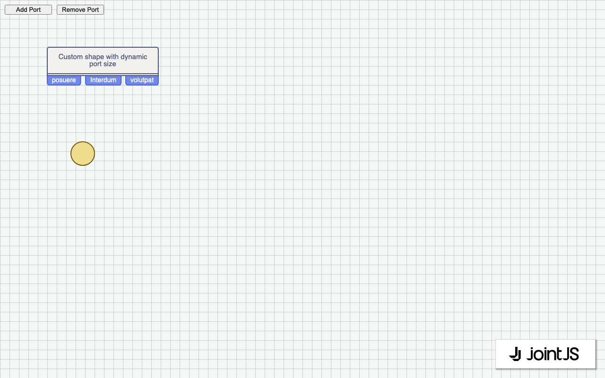

# JointJS: Element Connect Tool

Want to connect elements in a diagram using links? Take a look at this JointJS demo that leverages the element connect tool.

This demo is also available online at [jointjs.com](https://jointjs.com/demos/element-connect-tool).

## Available Versions

- [JavaScript](./js/)
