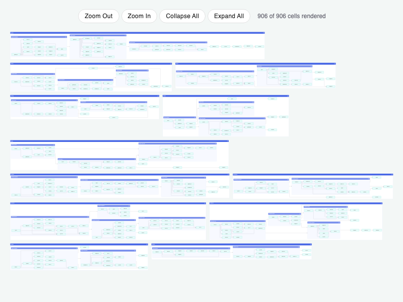

# JointJS: ELK Layout with Collapsible Clusters

A large hierarchical diagram laid out by the Eclipse Layout Kernel (ELK). Every cluster can be collapsed to hide its content, and only the cells within the visible area of the paper scroller are rendered.

## Available Versions

- [TypeScript](./ts/)

## Screenshot

