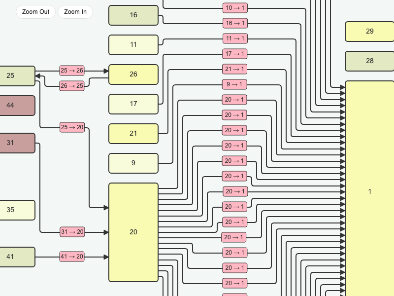

# JointJS: ELK Layout

This ELK Layout demo is built with TypeScript and shows how to use the [@joint/layout-elk](https://www.npmjs.com/package/@joint/layout-elk) package to create automatic diagram layouts powered by the Eclipse Layout Kernel (ELK).

## Available Versions

- [TypeScript](./ts/)

## Screenshot

