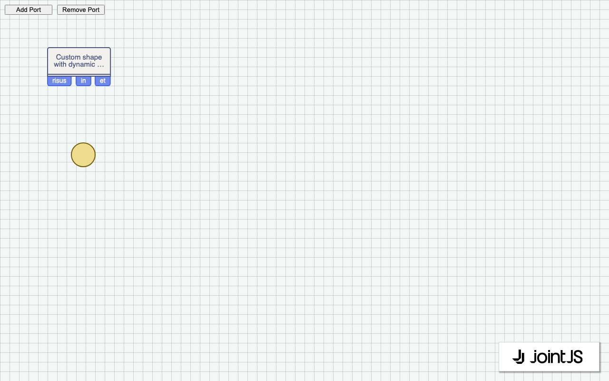

# JointJS: Flowchart

This flowchart created using our flowchart library shows a simple checkout process. Use it as a boilerplate for your application and let your users design the sequence of movements or actions. In addition, you can learn how to style the diagram in CSS and switch between light and dark modes.

This demo is also available online at [jointjs.com](https://jointjs.com/demos/flowchart).

## Available Versions

- [JavaScript](./js/)

## Screenshot

