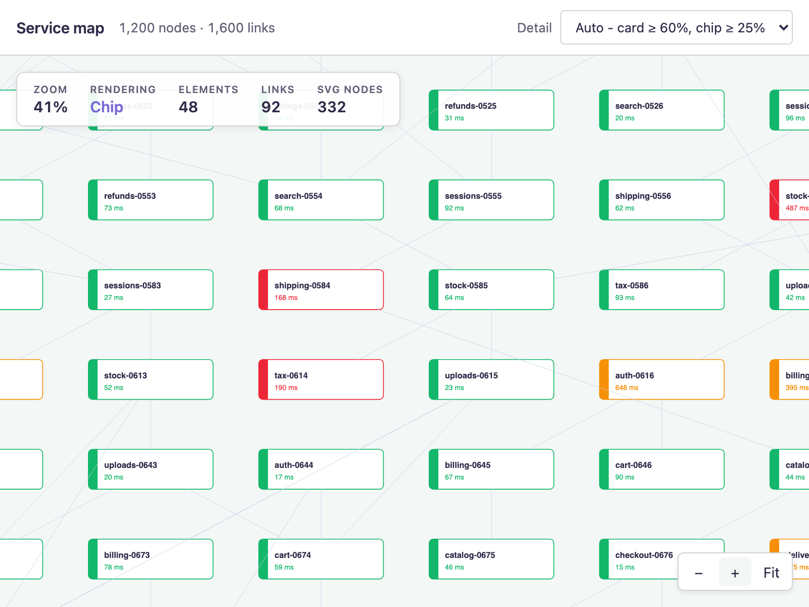

# JointJS+: Level of Detail (TypeScript) <a href="https://www.jointjs.com/jointjs-plus"></a>

A 1,200-node service map where every element swaps its rendering for a cheaper one as you zoom out: a full card at reading zoom, a plain chip in the middle, and a single tinted rectangle when the whole map is on screen.



## The idea

Virtual rendering controls **how many** cells get a view. Level of detail controls **how much each view draws**. They solve different halves of the same problem, and the second half is the one that survives zooming out: frame the whole map and every one of the 1,200 elements really is inside the viewport, so there is nothing for virtual rendering to skip. What each element costs to draw is all that is left to change.

The HUD shows the numbers side by side, which is the quickest way to see that the two mechanisms are independent:

| | Elements | Links | SVG nodes |
|---|---|---|---|
| `Fit` (8%), auto → **Block** | 1,200 | 0 | 1,200 |
| `Fit` (8%), pinned to **Card** | 1,200 | 0 | **12,000** |
| 31%, auto → **Chip** | 196 | 275 | 1,255 |
| 85%, auto → **Card** | 36 | 70 | 430 |

Pinning a level at `Fit` moves the node count by 10× while the element count does not budge. The counts add up, too: 196 chips of five nodes each plus 275 single-node links is 1,255.

> One gotcha if you build the same readout: `render:done` fires only when views were *updated* (`stats.updated > 0` in `updateViewsAsync`). A pass that merely unmounts cells that left the viewport — most of what zooming out does — is silent. `render:idle` covers it, and needs `autoFreeze: true` on the paper.

## How the level reaches the views

The level is **view state** — it is never written to a model, so zooming changes no cell and fires no graph event. `ServiceView` reads `paper.scale()` when it renders and rebuilds its markup only when that lands in a different band.

When a threshold is crossed, the views that already exist are nudged:

```ts
paper.on('scale', () => {
    const level = getActiveLevel(paper.scale().sx);
    if (level === currentLevel) return;   // twice in the whole zoom range
    currentLevel = level;
    requestDetailUpdate(paper, graph);
});

export function requestDetailUpdate(paper: dia.Paper, graph: dia.Graph): void {
    for (const element of graph.getElements()) {
        const view = paper.getCellView<dia.ElementView>(element);
        if (view) view.requestUpdate(view.getFlag(RENDER_FLAGS), { isolate: true });
    }
}
```

Three details matter here:

- **`paper.getCellView()`, not `paper.findViewByModel()`.** `getCellView()` returns a view only if one has already been instantiated — it does not resolve a placeholder and schedules nothing. `findViewByModel()` *does* resolve placeholders, so the same loop written with it would instantiate all 1,200 views on the first threshold crossing and virtual rendering would be over before the paper's update loop got a say.
- **The elements the scroller has not mounted need no telling.** When one is mounted the paper ORs in its init flag and the view renders from scratch, reading `paper.scale()` and landing on the right level by itself.
- **`{ isolate: true }`.** The paper's `onViewUpdate` updates every link connected to an element that updates, skipping that only for `mounting` and `isolate`. Without the flag, a threshold crossing would update every link on screen for a change that moves no geometry at all.

So a threshold crossing is a map lookup per element — twice in the whole zoom range — and a scheduled update only for the handful on screen. Panning fires no `scale` event at all, so it never touches a view's DOM.

## Two halves

The view is split so that the part worth copying is the part with no service map in it.

`LevelOfDetailView` (`level-of-detail-view.ts`) is the mechanism: the flags, the decision about when markup has to be replaced rather than rewritten, and the memory of which level the markup on screen was built for. It is abstract in seven places — one policy method and six drawing methods:

```ts
class MyView extends LevelOfDetailView {
    protected getLevel() { return myPolicy(this.paper.scale().sx); }

    protected renderHigh() { this.renderJSONMarkup(MY_CARD_MARKUP); }
    protected renderMedium() { ... }
    protected renderLow() { ... }

    protected updateHigh() { ... write the model into this.selectors ... }
    protected updateMedium() { ... }
    protected updateLow() { ... }
}
```

`ServiceView` (`service-view.ts`) is that subclass and nothing else: three markups and six short methods. To draw something other than a service map, it is the only file you write — copy `level-of-detail-view.ts` and `detail.ts` next to it and the machinery comes along unchanged.

`render*` and `update*` are separate for the same reason the flags are: `render*` builds DOM and runs only when the level changes; `update*` writes the model into the DOM that is already there and runs whenever the size or the data changes.

## Three flags, three kinds of work

`ServiceView` declares one flag per kind of work, which is what keeps a cheap change cheap:

| Flag | Raised by | Does |
|---|---|---|
| `Render` | a change of level (and the view's init flag) | throws the markup away and builds the level's markup |
| `Update` | `size`, `data` | writes the model into the markup that is already there |
| `Transform` | `position`, `angle` | `updateTransformation()`, nothing else |

```ts
presentationAttributes(): dia.CellView.PresentationAttributes {
    return {
        position: [Flags.Transform],
        angle: [Flags.Transform],
        size: [Flags.Update],
        data: [Flags.Update]
    };
}

confirmUpdate(flags: number): number {
    if (this.hasFlag(flags, Flags.Render)) this.render();
    if (this.hasFlag(flags, Flags.Update)) this.update();
    if (this.hasFlag(flags, Flags.Transform)) this.updateTransformation();
    return 0;
}
```

So renaming a service rewrites five text nodes; resizing one moves the bar and the pill; dragging one sets a transform. None of them rebuild DOM — only crossing a zoom threshold does, and that is the one thing that genuinely needs different markup.

`update()` draws for `this.level`, the level the markup was *built* for, not for whatever the paper's scale reads at that instant — otherwise a data change landing between a threshold crossing and the next `render()` would try to write card fields into block markup.

`render()` goes through `renderJSONMarkup()` rather than parsing the markup by hand. It is the part that keeps the view a well-behaved `CellView`: it resolves the root selector, merges group selectors, and assigns `this.selectors` — which is where `findNode()`, element tools and highlighters look a node up by name. (`this.vel.empty()` first, because it appends.)

## Why the links can be skipped

`isolate` is only correct because a link end cannot move when the level changes, and that is not free — by default an anchor and a connection point measure the element *view*, which here is markup that is swapped out from under them. Both are pointed at the model instead:

```ts
defaultAnchor: { name: 'center', args: { useModelGeometry: true }},
defaultConnectionPoint: { name: 'bbox', args: { useModelGeometry: true }}
```

The box on the model is identical at all three levels (one `size`, never touched), so a card becoming a block cannot drag a link end with it. Crossing 25% → 60% and back with 275 links on screen leaves all 275 path `d` attributes byte-identical.

Dragging an element still moves its links, of course: `isolate` is on the level-of-detail update, not on model changes.

## Features

- **Three markups, one size.** Card (10 SVG nodes, `≥ 60%`), chip (5, `≥ 25%`), block (1, below that). The level changes what an element *draws*, never how big it is: the size lives on the model, so the links, the quad-tree index and the scroller's viewport test all keep working on geometry that never moves.
- **A flagged custom `dia.ElementView`.** Three flags, one kind of work each, split from a reusable abstract base.
- **A detail picker that pins a level**, to show what the other two are worth.
- **Links are a level of detail too.** Below 25% they are not drawn at all, through the scroller's `cellVisibility`. At `Fit` all 1,600 of them are in the viewport, so virtual rendering would otherwise mount every one — and at that scale a 1px line is a grey haze that hides the status colours. It is the single biggest saving here, because the links outnumber the elements.
- **Draggable nodes.** Moving an element runs `updateTransformation()` and nothing else — the markup the level of detail built is untouched, which is the whole reason `confirmUpdate()` keeps `Render`, `Update` and `Transform` apart.
- **Composes with the other two performance features.** `dia.SearchGraph` in lazy quad-tree mode, and `ui.PaperScroller`'s `virtualRendering`.

## Controls

| Action | Result |
|--------|--------|
| Drag the canvas, or two-finger scroll | Pan |
| Trackpad pinch, or Ctrl + wheel | Zoom — watch the level in the HUD change at 60% and 25% |
| Drag a node | Move it — only `Transform` runs, so the markup is neither rebuilt nor rewritten |
| `+` / `−` / `Fit` | Zoom in, out, or frame the whole map |
| The **Detail** picker | Follow the zoom (`Auto`), or pin one level |

## Project Structure

| File | Description |
|------|-------------|
| `src/main.ts` | Styles and the entry point |
| `src/app.ts` | Graph, paper, scroller, the `scale` listener, the toolbar and HUD wiring |
| `src/detail.ts` | **The policy**: the `DetailLevel` type, the thresholds, and the picker's mode |
| `src/level-of-detail-view.ts` | **The reusable half**: `LevelOfDetailView`, the flags, and `requestDetailUpdate()`. Knows nothing about what a level looks like |
| `src/service-view.ts` | **The specific half**: the three markups and the six methods that draw them |

| `src/shapes.ts` | The `Service` element, the `Link`, the one element size |
| `src/generate-graph.ts` | The seeded 1,200-element grid and its links |
| `src/theme.ts` | The palette the markup needs |
| `src/styles.css` | Page chrome and the HUD |

## How It Works

1. `generateCells()` builds 1,200 `Service` elements and 1,600 links from a fixed seed. Every element carries the same `size` — the box all three markups draw into — and a `data` slice with the service's name, group, region, latency, load and status.
2. The graph is a `dia.SearchGraph` in lazy quad-tree mode: it is written once, at load, and only ever queried afterwards.
3. The paper needs `viewManagement` — the scroller's virtual-rendering controller refuses to start on a paper in legacy mode, and `legacyMode` is simply `!options.viewManagement`. `lazyInitialize` is also what makes `getCellView()` meaningful: an element the scroller has never shown has a placeholder rather than a view.
4. `ui.PaperScroller` with `virtualRendering` gives a view only to the cells inside the viewport. At 85% that is 100 elements out of 1,200; at `Fit` it is all of them.
5. `ServiceView.confirmUpdate()` keeps `Render`, `Update` and `Transform` apart, so only a level change replaces DOM.
6. The scroller's `cellVisibility` hides every link below 25%. The controller composes it with its own viewport test — ours runs first and short-circuits — and re-runs the whole check on the paper's `transform` event, so the links come back by themselves on the way in.

## What level of detail actually buys

Worth being precise, because the obvious measurement is the wrong one.

**It does not show up in the frame rate while panning.** JointJS pans by transforming the SVG root, so a pan re-renders nothing — panning is a flat 60fps at every level, cards included.

Where it shows up is **layout and paint**. A 10-step zoom sweep at `Fit`, measured through the CDP performance counters in headless Chromium at 1440×820:

| Pinned level | SVG nodes | Layout | Script | Total task |
|---|---|---|---|---|
| Block | 1,200 | 71 ms | 560 ms | 882 ms |
| Chip | 6,000 | 191 ms | 604 ms | 1,151 ms |
| Card | 12,000 | 302 ms | 596 ms | 1,407 ms |

Script time is flat — that is the paper's view management, and it is what *virtual rendering* addresses. Layout time is 4× across the three levels, and that is what the level of detail addresses. Headless Chromium does not rasterize, so the real-browser gap is wider than this, not narrower.

## Running the Demo

To run this application you need to have access to the JointJS+ package. You can get it by having a JointJS+ license or by starting a [free trial](https://www.jointjs.com/free-trial).

If you are a trial user, you received your access token during the trial sign-up process.
If you are a customer, log in to the customer portal at https://my.jointjs.com to obtain your access token.

This example uses the `.npmrc` file to set up access to the JointJS+ private npm registry. By default it reads the authentication token from the `JOINTJS_NPM_TOKEN` environment variable, which you can set in your terminal or CI environment:

**macOS / Linux**:
```sh
export JOINTJS_NPM_TOKEN="jjs-xxxxxxxx-xxxx-xxxx-xxxx-xxxxxxxxxxxx"
```

**Windows (PowerShell)**:
```sh
$env:JOINTJS_NPM_TOKEN="jjs-xxxxxxxx-xxxx-xxxx-xxxx-xxxxxxxxxxxx"
```

Learn more about our [private npm registry here.](https://docs.jointjs.com/learn/help-center/npm-registry)

After setting up access to the JointJS+ package, install the dependencies and start the dev server:

```bash
npm install
npm run dev
```
