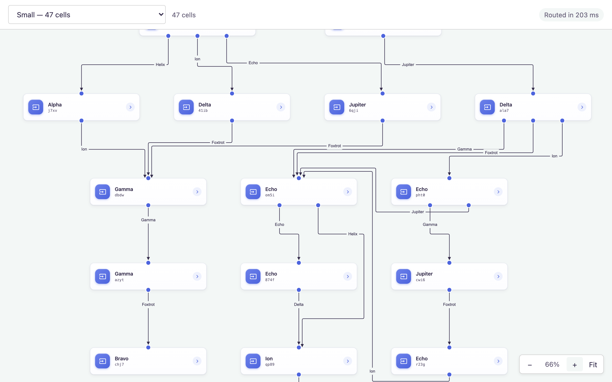

# JointJS: Standalone Link Routing with Libavoid (React)

Libavoid offers high-quality orthogonal link routing that navigates around
objects and avoids overlapping parallel links. This variant is the React port of
the JavaScript demo's **Web Worker (performance) example**: a flowchart of up to
2000 cells, routed off the main thread, drawn on a `@joint/react-plus` canvas
with React-rendered nodes.

A dropdown switches between three graphs, and the toolbar reports how long each
routing pass took.



| Graph | Cells | Ports | Routed in |
|---|---|---|---|
| Small | 47 (21 nodes / 26 links) | yes | ~220 ms |
| Large | 823 (379 / 444) | yes | ~3.5 s |
| Stress | 2000 (750 / 1250) | no | ~2.3 s |

The first two are `example-1.json` / `example-2.json`, byte for byte the graphs
the JavaScript variant loads, so both variants stress the router with exactly
the same diagram.

The third is generated (`src/data/generate-graph.ts`) — as a saved file it would
be several megabytes. It is deterministic, so a routing time means something
across reloads. It routes *faster* than the large graph despite carrying three
times the links: without ports each shape has a single central connection pin
instead of one per port, and pin count is what Libavoid's cost is driven by.

## Running the application

```bash
npm install
npm run dev
```

A JointJS+ token is required — see the [repository README](../../README.md).

## What this variant demonstrates

### Nodes are HTML

Nodes are React components (`src/components/render-node.tsx`) rendered through
`<Paper renderElement>`, not JointJS shape classes — and their content is plain
HTML, mounted by `<HTMLHost useModelGeometry>` into a `foreignObject`.

Going through HTML is what buys the card its layout. Flexbox places the badge,
the text column and the chevron, so no offset is hard-coded to the 344×80 box;
`text-overflow: ellipsis` truncates a long title with no JS; and the gradient
fill, `box-shadow` and `:hover` feedback are stylesheet lines rather than hand-
built geometry. Styling lives in `index.css`, so retheming the nodes touches no
TypeScript at all.

`useModelGeometry` is the flag that matters for a graph this size. Without it
`HTMLHost` runs `useMeasureElement` and syncs the measured box back to the
element — a `ResizeObserver` round trip for each of the 750 nodes between the
graph loading and the first route being computed. With it, the host reads
`width` / `height` straight off the model (`useCell(selectElementSize)`); these
cards are a fixed size per kind, written onto the model in `src/data/cells.ts`,
so there is nothing to find out.

Everything else downstream reads that same model geometry rather than the DOM:
the fit (`useModelGeometry: true`), the quad-tree spatial index, and virtual
rendering's viewport test — which matters, because with virtual rendering most
cells have no rendered box to measure in the first place.

`renderElement` receives the element's `data` slice only, so dragging a node
never re-runs the component — JointJS moves the rendered node itself.

### Virtual rendering

`<PaperScroller virtualRendering>` gives a view only to the cells inside the
viewport. Zoomed in on the stress graph that is a few dozen out of 2000, which
is the difference between a canvas that pans smoothly and one holding 750 React
subtrees and 1250 link paths at once.

It is read at mount only, which is one reason the app remounts the whole
`<Diagram>` when a different graph is chosen.

Virtual rendering is also why the pending-route look lives on the link's own
`attrs` (`src/routing/awaiting.ts`) rather than on a view highlighter: a link
scrolled off-screen has no view to hold one, and would come back without it.

### Spatial index

`<Diagram spatialIndex>` backs the graph with a `dia.SearchGraph` — a quad-tree
over element bounds. Every pointer gesture, and the viewport check virtual
rendering runs, is a spatial query; on 750 elements a linear scan for each is
what makes a large graph feel slow.

It is set to `{ isQuadTreeLazy: true }` rather than the eager default. Eager
reindexes each cell as it is written — dragging a node reindexes the node and
every link attached to it on every pointer move, and the routed reply then
reindexes each of the ~1250 links again as its vertices land, all before
anything asks a question. Lazy marks the tree dirty instead and rebuilds once,
on the next query. The write bursts here are large and the queries between them
are few, which is the shape lazy mode is for.

Worth knowing if you tune this: there is no per-write opt-out.
`SearchGraph`'s change handlers take only the cell, never the `set()` options,
so the levers are the mode itself, `invalidateQuadTree()` around a burst,
`setQuadTreeIndexFilter()` for which cells are indexed at all, and
`{ useIndex: false }` per query.

## How the routing works

The graph owns the state on both sides of the worker boundary.

```
   main thread                                worker
   ───────────                                ──────
   dia.Graph  ──── reset / add / change ────▶  dia.Graph
   (the diagram)         (cell JSON)          (a shadow of it)
                                                   │
                                              AvoidRouter
                                              (libavoid-js)
                                                   │
   link.set(...) ◀────── routed ──────────────  routes
```

- `src/routing/use-avoid-router.ts` replays every graph edit to the worker as
  plain `cell.toJSON()`, and sets each route it gets back **straight onto the
  link model**. `@joint/react-plus` is subscribed to the graph, so the canvas
  follows without a single route passing through a React render.
- `src/routing/router-worker.ts` keeps a `dia.Graph` of its own. The React cell
  types deserialize into plain `dia.Element` / `dia.Link` there — the React half
  of those models is markup and a portal target, neither of which means anything
  without a paper.
- `src/routing/avoid-router.ts` is a TypeScript port of the JavaScript variant's
  `shared/avoid-router.js`, unchanged in behaviour. It never touches the DOM,
  which is what lets the worker run it.
- `processTransaction()` is debounced, so a drag costs one routing pass rather
  than one per pointer move.

A link with no route yet is drawn dashed and faded until its route arrives.

### The `.wasm` file

`libavoid-js` does not export `dist/libavoid.wasm` as a subpath, and a worker
has no `document` to derive its own URL from. `vite.config.ts` locates the file
next to the package entry point and aliases it, so `?url` treats it as an
ordinary asset: hashed and emitted by the build, served from `node_modules` in
dev.

## Differences from the JavaScript variant

- Panning is the `<PaperScroller>`'s (drag the background, wheel to scroll,
  pinch to zoom) with explicit zoom controls, in place of the JS variant's
  click-to-fit and rubber-band-zoom gestures.
- When Libavoid cannot find a usable route, the `rightAngle` fallback the router
  chose is carried back to the paper. The JS variant overwrites it with
  `normal`, which draws those links straight.
