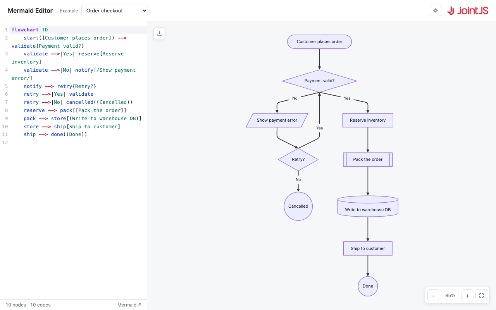

# JointJS+: Mermaid Editor 

The Mermaid Editor demo turns [Mermaid](https://mermaid.js.org/) flowchart source into native JointJS cells. Mermaid's own parser reads the text, and the resulting nodes and edges are mapped onto declarative `@joint/react-plus` cell records — every Mermaid node shape is drawn as a real SVG element that sizes itself to its label, edges keep their arrow heads, line styles and labels, and a directed-graph layout arranges the result in the direction the diagram declares. Edit the source on the left and the diagram on the right is reparsed and re-laid out as you type, with Mermaid syntax highlighting in a CodeMirror editor. Unlike a Mermaid-rendered image, the output is a live JointJS graph on a `PaperScroller` canvas you can pan and zoom, in a light or dark theme. Click a node and every mention of it lights up in the source; move the caret and the diagram follows. Double-click a node to rename it in place, across as many lines as you like, or select one for a toolbar carrying its shape and fill — each control writing a targeted edit back into the Mermaid text, so the source stays the single source of truth.

This demo is also available online at [jointjs.com](https://jointjs.com/demos/mermaid-editor).

## Available Versions

- [React](./react/)

## Screenshot

