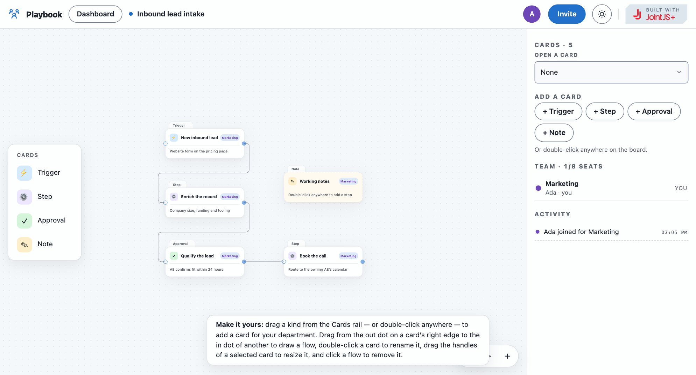

# JointJS+: Playbook Collaboration 

The Playbook demo is a real-time, multiplayer process designer built on `@joint/react-plus`: every collaborator takes a department seat on a shared board and maps triggers, steps, approvals and notes together, with live cursors, a frame and name on whatever card a colleague has their hands on, and an activity feed. The board is one zustand store mirrored through [Liveblocks](https://liveblocks.io), and the JointJS graph is a controlled projection of it: cards and flows are derived from the shared document, presence (cursors, drags, resizes, edits, flows in the air) is drawn into the cells themselves, and every gesture on the canvas writes back to the store so all boards stay identical. Without a Liveblocks key the same board runs across the tabs of one browser over `BroadcastChannel`.

This demo is also available online at [jointjs.com](https://jointjs.com/demos/playbook-collaboration).

## Available Versions

- [React](./react/)

## Screenshot

