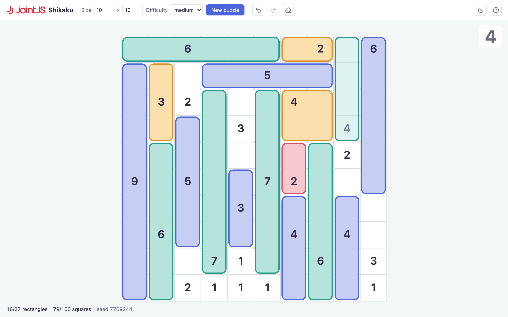

# JointJS+: Shikaku <a href="https://www.jointjs.com/jointjs-plus"></a>

Shikaku is a Japanese pencil puzzle: a grid of squares, some carrying a number.
Cut the grid into rectangles so that every rectangle holds exactly one number and
covers exactly that many squares.

This demo plays it on a JointJS canvas. Every square of the board is a graph
element, and a rectangle is swept out by pressing on one square and dragging —
the squares light up as the pointer moves, in the color the rectangle will keep.
Boards are generated on demand at any size, and each one is checked to have a
single solution before it reaches the screen.

## Available Versions

- [React](./react/)

## Screenshot



## Running it

This demo depends on JointJS+, which is published to a private npm registry, so
installing it needs an access token. You can get one with a JointJS+ license or
a [free trial](https://www.jointjs.com/free-trial): trial users receive the
token during sign-up, and customers can find it in the customer portal at
https://my.jointjs.com.

Each demo's `.npmrc` points the `@joint` scope at the registry and reads the
token from the `JOINTJS_NPM_TOKEN` environment variable, so set that before
installing:

**macOS / Linux**:
```sh
export JOINTJS_NPM_TOKEN="jjs-xxxxxxxx-xxxx-xxxx-xxxx-xxxxxxxxxxxx"
```

**Windows (PowerShell)**:
```powershell
$env:JOINTJS_NPM_TOKEN="jjs-xxxxxxxx-xxxx-xxxx-xxxx-xxxxxxxxxxxx"
```

Then install and run the variant you want:

```sh
cd react
npm install
npm run dev
```

See [the React variant's README](./react/) for how the demo is built, and
[the private npm registry docs](https://docs.jointjs.com/learn/help-center/npm-registry)
if the install gives you trouble.
