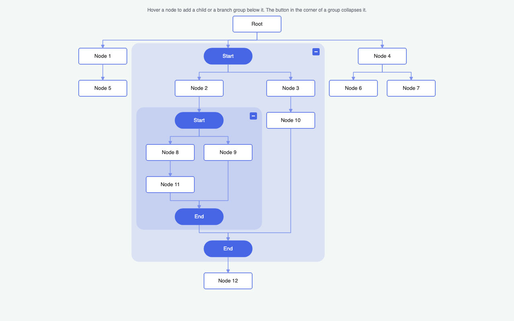

# JointJS+: Tree Layout with Branch Groups (React) <a href="https://www.jointjs.com/jointjs-plus"></a>

A tree laid out by `layout.TreeLayout` in which a node can be a *group*: a container with a start node, some content and an end node. A *branch group* holds two branches that converge into the end node — a fork/join. A *cycle group* holds a tree that grows down on the right and a return path that climbs back up on the left, from the end node to the start node — a loop. The tree connects to a group as a single node, so subgraphs that a tree layout cannot handle on its own fit into the tree. Groups nest and collapse. Built with `@joint/react-plus`.



## Features

- **Groups in a tree** -- a group is one node of the tree: the outer links connect to the group element, not to the start and end nodes inside it. The group hugs its content, from the top of its start node to the bottom of its end node, but it is never rendered: the paper's `cellVisibility` hides it, so it is a node of the layout only. A custom anchor puts the outer links on the axis of the two gates, and the tree layout's vertices are computed on that axis too -- the tree connects to the start and end nodes, as far as the eye can tell, even when the content is wider on one side of them.
- **Bottom-up layout** -- every group is laid out on its own with `treeLayout.layoutTree(start)`, then sized from its start to its end node, the deepest groups first. The outer tree is laid out last, once the size of every group is known.
- **Branch groups: converging branches** -- the tree layout only knows trees, so the end node is excluded from the layout of a group with the `filter` option. It is then placed below the branches and joined to them by a horizontal bar that mirrors the vertices the tree layout draws below a parent.
- **Cycle groups: a loop of two trees** -- the tree on the right grows down from the start node and its leaves converge into the end node; the return path on the left grows up from the end node (a tree layout with the direction `T`) and its leaves converge back into the start node. Each tree is laid out on its own; the return path is placed left of the tree, and both gates sit in the middle of the group, so that the tree continues straight through it. The tree on the right hangs from the start node and joins the end node with the usual bars; the return path leaves the end node and enters the start node sideways. Its links are dashed, as they run against the flow of the tree.
- **Nested, collapsible groups** -- a node of a branch, or of the tree on the right of a cycle, can be a group itself, of either kind. Hovering the start node of a group shows its collapse button. A collapsed group shrinks to the size of a node and hides its content (the `cellVisibility` prop of the `<Paper>`); its start node (labelled `Branch` or `Loop`, the kind of the group) stays in its place and stands in for it -- the tree is laid out again around it, and what is added below that node continues the tree below the group.
- **Editing** -- hover a node to add a child node, a branch group or a cycle group below it, or to delete it. The end node of a group is a small plus button, and the links into it have no arrowhead: a click on it opens a menu (`ui.ContextToolbar`) with what can be added below the group -- a node, a branch, a loop -- and what is added there continues the tree from the group. The start node of a group carries the group's collapse button and its delete button; while the group is collapsed, it also takes over the add buttons of the hidden end node. On the return path of a cycle the tree grows up, so the buttons sit on the top edge, and only a child node can be added there: a group reads top-down, from its start to its end.
- **Deleting** -- a deleted node is spliced out: its children move up to its parent, in its place. A group is deleted with its content; what hung below it moves up to the group's parent. A parent left without children inside a group becomes a leaf and connects to its sink again. The root and the end nodes cannot be deleted (the start node deletes its group), and neither can the last node of a branch or of the tree on the right of a cycle -- the start node would link to the end node directly. The return path of a cycle may be emptied: the end node then links straight to the start node, around the left side of the group, and hovering that link shows a button that inserts a node into it.
- **React-rendered elements, two models** -- the nodes and the groups are two `ElementModel` subclasses (`tbg.Node`, `tbg.Group`) whose state lives in `data`. The `renderElement` callback of `<Paper>` renders a `<Cell>` that reads the model type with `useCell(selectCellType)` and renders a `<NodeView>` for a node, which reads its size and `data` with `useCell()` too; a group is hidden by the paper and never rendered. The links keep their JointJS markup. The imperative parts -- the layout and the element tools -- run against the `dia.Paper` and `dia.Graph` that `usePaper()` and `useGraph()` expose.

## Controls

| Action | Result |
|--------|--------|
| Hover a node, click `+` | Add a child node |
| Hover a node, click the fork button | Add a branch group as a child |
| Hover a node, click the loop button | Add a cycle group as a child |
| Hover a node on the return path of a cycle | The buttons on the top edge; only `+`, a group cannot be inserted there |
| Hover a node, click the red `×` in the corner | Delete the node; its children move up to its parent |
| Click the end node of a group (the small plus) | A menu: add a node, a branch group or a cycle group below the group |
| Hover the start node of a group, click the red `×` | Delete the whole group |
| Hover the link from the end node of a cycle straight to its start node, click `+` | Insert a node into the emptied return path |
| Hover the start node of a group, click `-` / `+` in its top left corner | Collapse or expand the group |
| Hover the start node of a collapsed group | The `+` to expand it, the `×`, and the add buttons of the hidden end node |

## Project Structure

| File | Description |
|------|-------------|
| `src/main.tsx` | App entry point -- styles and the React root |
| `src/app.tsx` | `<Diagram>` and `<Paper renderElement>`, plus the headless `<Editor>` that seeds the diagram, runs the layout and wires the hover tools of the elements and the links |
| `src/render-element.tsx` | The `renderElement` callback -- renders `<Cell>` |
| `src/cells.tsx` | `<Cell>` picks the component by `useCell(selectCellType)`; `<NodeView>` is a labelled rectangle (a pill for the start of a group, a small plus button for its end). A group is hidden by the paper and has no component |
| `src/shapes.ts` | The `Node` and `Group` models (`ElementModel` subclasses with typed `data`; a group has a `kind`, `branch` or `cycle`, is never rendered; its start node is labelled with the kind), the JointJS `Link` (dashed on the return path of a cycle), and the layout metrics |
| `src/branch-group.ts` | Everything specific to a branch group: its content (a start node, two branches, an end node) and its layout -- one `TreeLayout` pass from the start, the end node joined below the branches |
| `src/cycle-group.ts` | Everything specific to a cycle group: its content (a start node, a node below it on the right, an end node, and the link back to the start), its layout -- one `TreeLayout` pass down from the start, one up from the end, the loop vertices -- and the rules of its return path: it grows up, takes no groups and may be emptied |
| `src/tree-layout.ts` | Shared by both kinds: the `TreeLayout` factory (with vertices that run on the axis of the gates of a group), the bars that join a gate to the roots below it and the leaves of a tree to the gate below them, and the sizing of a group around its content |
| `src/gate-anchor.ts` | The anchor of every link end: a link into a group meets it at its start node, a link out of a group leaves it at its end node |
| `src/layout.ts` | The bottom-up layout: one pass per expanded group, dispatched by its kind, then one for the outer tree. Also the visibility predicate shared with the paper |
| `src/actions.ts` | Adds a child node or a group of either kind below an element, keeping the new cells embedded in the enclosing group and connected to the gate the leaves of its path converge into; deletes an element, moving its children up to its parent; inserts a node into a link |
| `src/add-menu.ts` | The add menu of a group: a `ui.ContextToolbar` below its plus button with the three things that can be added |
| `src/tools.ts` | The hover tools -- a row of `elementTools.Button`s on the edge the tree grows from, a delete button in the opposite corner, the collapse/expand button on the start node of a group, a `linkTools.Button` on an emptied return path, and the click on the plus button of a group that opens the add menu |
| `src/index.css` | Page layout |

`layout.ts`, `actions.ts`, `branch-group.ts`, `cycle-group.ts`, `tree-layout.ts`, `gate-anchor.ts` and `add-menu.ts` are the same files as in the [TypeScript version](../ts/); `shapes.ts` keeps the same model API on top of `ElementModel`.

## How It Works

1. A group embeds its start node, its content, its end node and the inner links. The outer links (`parent → group`, `group → child`) are attached to the group element. A branch group embeds two branch nodes and the links `start → a`, `start → b`, `a → end`, `b → end`. A new cycle group embeds a node `a` below the start and the links `start → a`, `a → end`, `end → start`: its return path is empty until a node is inserted into the last link.
2. `runLayout()` sorts the expanded groups by depth, deepest first, and lays each of them out by its kind. A fresh `TreeLayout` is used for every tree: its `updatePosition` moves elements with `{ deep: true }`, so a nested group carries its content along, and its `filter` drops the gate the tree would otherwise run into (the end node below the branches, the start node above the return path), so that the content stays a tree.
3. *Branch group:* `layoutTree(start)` lays out the branches. The end node is placed below the bounding box of that tree (`treeLayout.getLayoutArea(start)`) on the vertical axis of the start node, and the links into it get two vertices forming a horizontal bar.
4. *Cycle group:* `layoutTree(start)` lays out the tree on the right and `layoutTree(end)` with the direction `T` the return path. The return path is placed left of the tree, a gap apart, and both are shifted so that the axis of the start node runs through the middle of them; the end node is placed below the taller of the two on that axis -- both gates sit in the middle of the group. (Should the return path be wider than the tree, it stays clear of the gates instead, and the group is wider than its content.) On the right the links are those of a tree: a bar below the start node to the roots, a bar above the end node from the leaves. On the left they loop: out of the end node sideways and up on the axis of a root, up on the axis of a leaf and into the start node sideways.
5. In both cases the group is positioned and sized by hand: from the top of the start node to the bottom of the end node, as wide as its content. The `defaultAnchor` of the paper is the custom `gateAnchor`: a link into a group is anchored at the top middle of its start node, a link out of a group at the bottom middle of its end node. With the `bbox` connection point on the model geometry (`useModelGeometry`), the outer links meet the group exactly where the start and end nodes are. The `updateVertices` callback of every `TreeLayout` draws the usual horizontal bar between the *axes* of the parent and the child, not between the middles of their boxes, so a link into a group turns down on the axis of its gates.
6. A collapsed group skips all of that: it is resized to a node and its start node is placed over it. The paper's `cellVisibility` hides every group, every cell that has a collapsed ancestor -- except the start node of the collapsed group itself -- and every link whose end is hidden. The links to a hidden group still render: the paper routes them from the models (`useModelGeometry`), which is also why the `gateAnchor` reads the gates from the models.
7. Finally the outer tree is laid out from the root with `layoutTree(root)`. `layout()` is not used, because it would start a tree from every source of the graph -- including the start node of every group. The paper is then scaled to fit the visible content.
8. When a node inside a group gets a child, the child is connected to the *sink* of its path: the end node in a branch group; in a cycle group the end node on the tree on the right and the start node on the return path (found by walking up to the gate the path starts from). The link a leaf had to the sink moves down to its first child. Deleting a node reverses this: `element.remove()` takes the embedded content and the connected links along, the children are linked to the parent with sibling ranks that keep them in place, and a parent left without children gets a link to the sink.
9. In React, all of this happens in the headless `<Editor>` component rendered inside `<Paper>`. A layout effect seeds the diagram once and runs the layout. `useOnPaperEvents()` handles the hover events of the elements and the links, adding the `dia.ToolsView` imperatively to the hovered view, and the click on the plus button of a group, which opens the `ui.ContextToolbar` on the view's element; every tool action, the collapse button included, edits the graph and lays the tree out again.

## Running the Demo

To run this application you need to have access to the JointJS+ package. You can get it by having a JointJS+ license or by starting a [free trial](https://www.jointjs.com/free-trial).

If you are a trial user, you received your access token during the trial sign-up process.
If you are a customer, log in to the customer portal at https://my.jointjs.com to obtain your access token.

This example uses the `.npmrc` file to set up access to the JointJS+ private npm registry. By default it reads the authentication token from the `JOINTJS_NPM_TOKEN` environment variable, which you can set in your terminal or CI environment:

**macOS / Linux**:
```sh
export JOINTJS_NPM_TOKEN="jjs-xxxxxxxx-xxxx-xxxx-xxxx-xxxxxxxxxxxx"
```

**Windows (PowerShell)**:
```sh
$env:JOINTJS_NPM_TOKEN="jjs-xxxxxxxx-xxxx-xxxx-xxxx-xxxxxxxxxxxx"
```

Learn more about our [private npm registry here.](https://docs.jointjs.com/learn/help-center/npm-registry)

After setting up access to the JointJS+ package, install the dependencies and start the dev server:

```bash
npm install
npm run dev
```
