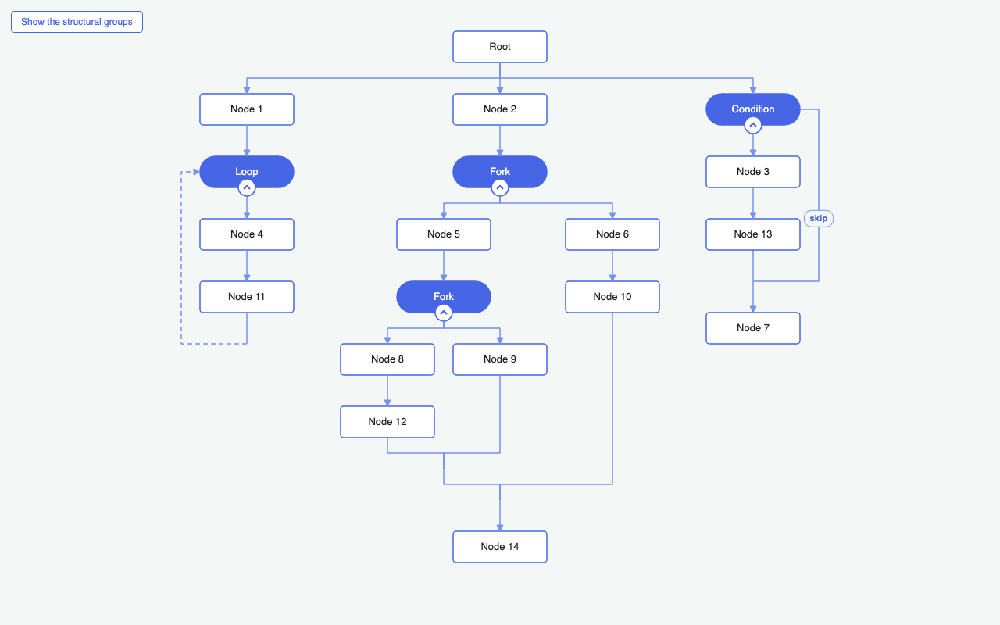

# JointJS+: Tree Layout with Forks and Loops (React) <a href="https://www.jointjs.com/jointjs-plus"></a>

A tree laid out by `layout.TreeLayout` in which a node can be a *group*: a container with a start node, some content and an end node. A *fork group* holds two branches that converge into the end node — a fork/join. A *loop group* holds a tree whose end node links back to the start node — a cycle, drawn as a dashed return link up the left side of the group. An *if group*, labelled *Condition*, holds one branch and a `skip` line that goes past it, running down the right side of the group, beside its content — the return link of a loop, the other way round. The tree connects to a group as a single node, so subgraphs that a tree layout cannot handle on its own fit into the tree. Groups nest and collapse. Built with `@joint/react-plus`.



## Features

- **Groups in a tree** -- a group is one node of the tree: the outer links connect to the group element, not to the start and end nodes inside it. The group is sized so that its top center is the top center of its start node and its bottom center is the bottom center of its end node -- the tree appears to connect to those two directly. The start node is the group itself, labelled with its kind, and it carries the tools of the group: the toggle, and the buttons that continue the tree past the group. The end node is a point, sized 0x0, where the branches meet again; it draws nothing, takes nothing and is drawn into without an arrow -- an arrival at a point of the layout is not an arrival at a node.
- **Bottom-up layout** -- every group is laid out on its own with `treeLayout.layoutTree(start)`, then sized from its start to its end node, the deepest groups first. The outer tree is laid out last, once the size of every group is known.
- **Converging branches** -- the tree layout only knows trees, so a link that joins a branch back into the flow is kept out of it: the `filter` option drops every child a *join* link leads to (`Link.createJoin()`), and with it the end node of every group, whether the link comes from the leaf of a branch or is the `skip` line of an `if`. The join is then drawn by hand, a horizontal bar that mirrors the vertices the tree layout draws below a parent. The same filter drops what is hidden inside something collapsed, which takes no room in the tree either.
- **Loops** -- a loop group holds a tree like a fork group does, and its end node links back to its start node: the return link, dashed as it runs against the flow, routed by hand out of the end node to the left, up the side of the group beside its content and into the start node. The tree layout treats it as a link like any other: it only follows the outbound links of the tree, and the end node is excluded, so the cycle never reaches it.
- **Room for a link, in the box** -- the box of a loop is a gap wider than its content on both sides, and so is the box of an `if`, so that the link running down the side of either has somewhere to be. The room is part of the width on purpose. A width is geometry: every bounding box, every fit and every layout around the group accounts for it without being told. The tree layout does have attributes for exactly this, `prevSiblingGap` and `nextSiblingGap`, but they are an instruction to one layout and reach no further - and, being applied to one side, they move the element by half of what they reserve, so a group that wants room on the left has to ask for the same on the right to stay under its parent. The box costs neither.
- **Conditional branches** -- an `if` group holds a branch like any other group, standing on the axis and growing straight down, and a second way out of its start node: the `skip` line, which goes past the branch and joins the flow again at the end node. It is routed by hand out of the start node to the right, down the side of the group beside the branch and into the end node from the right -- the return link of a loop mirrored, running with the flow instead of against it. It carries the one label of the diagram, a chip in the middle of the line, and the way into the branch carries none: a branch on the axis reads as the way taken without being told. Nothing hangs beside the group, so the axis of the `if` stays under its parent and the room it asks for is one gap on each side, the same as a loop.
- **Why the branch is not a `BR` child** -- hanging the branch to the right of the node, which is what the `BR` direction of the tree layout is for, puts the ink of the subtree on one side of its root. A layout area is centered under its parent as a whole, so the root is then pushed the other way by half of what hangs beside it: an `if` with an empty continuation sat 78px left of its parent, and reserving the same width on the empty side to correct that wasted a column as wide as the branch. A line running outside the box costs a gap instead of a column, which is why a loop already does it that way.
- **The groups are scaffolding** -- and are off to begin with: the diagram is the tree, and a group is what the layout hangs a subgraph on. The button in the corner of the page puts the slabs of the expanded groups on the paper (`cellVisibility`), to be looked at once and switched off again. Without them the tree stands as it is: the outer links of a group end where its start and end node are, because that is how the group is sized, so nothing moves and nothing dangles. The toggle hangs on the start node, not on the slab, so it survives the switch and a group can be collapsed whether or not its slab is drawn. The layout runs on the diagram as it is, whether or not the slabs are drawn, so the switch is one `paper.updateCellsVisibility()` and no layout. It runs last in every refresh: laying the tree out brings the views back on the paper.
- **Nested, collapsible groups** -- a node of a branch or of a loop can be a group itself, of any kind. Collapsing one hides its content (the `cellVisibility` option of the paper), the return link of a loop and the `skip` line of an `if` included, and leaves its start node standing where it was: nothing changes shape or colour, the diagram simply gets shorter. The box of the group is then that node alone, so the tree is laid out again around a node-sized group.
- **Editing** -- hover a node to add a child node, a fork group, a loop group or an `if` group below it, to make it wider, or to remove it. Removing hands the children of a node to its own parent; removing the start node of a group takes the group with its whole content, and hands on what followed the group. A node that ends a branch joins the end node of its group, so a removal moves that join up to whatever is left of the branch. The start node of a group stands in for its group: what is added there continues the tree past the group, not inside it. Inside an `if` group that leaves the branch as the only place that grows.

## Controls

| Action | Result |
|--------|--------|
| Hover a node, click `+` | Add a child node |
| Hover a node, click the fork button | Add a fork group as a child |
| Hover a node, click the loop button | Add a loop group as a child |
| Hover a node, click the condition button | Add an `if` group, labelled *Condition*, as a child |
| Hover a node, click the button in its top right corner | Make it 20px wider, and watch the tree lay itself out around it |
| Hover a node, click the cross in its top left corner | Remove it; what hung on it moves up to what it hung on. On the start node of a group, the whole group goes |
| Hover the start node of a group, collapsed or not | The same buttons, acting on the group: what they add follows the group |
| The chevron on the bottom edge of a start node | Fold the group away, or bring it back |
| The button in the corner of the page | Show the slabs of the expanded groups, or hide them again |

## Project Structure

| File | Description |
|------|-------------|
| `src/main.tsx` | App entry point -- styles and the React root |
| `src/app.tsx` | `<Diagram>` and `<Paper renderElement>`, plus the headless `<Editor>` that seeds the diagram, runs the layout, wires the events (a group's `data.collapsed` change, the hover tools) and renders the button that shows the slabs |
| `src/render-element.tsx` | The `renderElement` callback -- renders `<Cell>` |
| `src/cells.tsx` | `<Cell>` picks the component by `useCell(selectCellType)`; `<NodeView>` is a labelled rectangle, a pill for the start node of a group and nothing to look at for its end node, `<GroupView>` is the translucent slab |
| `src/shapes.ts` | The `Node` and `Group` models (`ElementModel` subclasses with typed `data`; a group's `data.kind` is fork, loop or if), the JointJS `Link` (dashed for the return link of a loop, labelled where it goes past the branch of an `if`, marked when it joins a branch back into the flow), and the layout metrics |
| `src/layout.ts` | The bottom-up layout: one `TreeLayout` pass per expanded group, then one for the outer tree; the routes of the two links that run inside a box beside the content, the return link of a loop and the `skip` line of an `if`. Also the visibility predicates, one for the layout and one for the paper |
| `src/actions.ts` | Adds a child node or a group of any kind below an element, removes one, keeps the new cells embedded in the enclosing group and joins every leaf of a branch to the end node it converges on |
| `src/tools.ts` | The toggle of a group - an `elementTools.Button` shown all the time on the bottom edge of its start node - and the buttons of a hovered element |
| `src/index.css` | Page layout |

`layout.ts` and `actions.ts` are the same files as in the [TypeScript version](../ts/); `shapes.ts` keeps the same model API on top of `ElementModel`.

## How It Works

1. A group embeds its start node, its content, its end node and the inner links: for a fork group two branch nodes and four links (`start → a`, `start → b`, `a → end`, `b → end`); for a loop group one node, `start → a`, `a → end` and the return link `end → start`; for an `if` group one node, `start → a`, `a → end` and the `skip` line `start → end`. The outer links (`parent → group`, `group → child`) are attached to the group element.
2. `runLayout()` sorts the expanded groups by depth, deepest first. For each of them a fresh `TreeLayout` lays out the tree that grows from the start node. Its `filter` drops the end node, so the two branches stay a tree, and its `updatePosition` moves elements with `{ deep: true }`, so a nested group carries its content along.
3. The end node is placed below the bounding box of that tree (`treeLayout.getLayoutArea(start)`) on the vertical axis of the start node, and the links into it get two vertices forming a horizontal bar. The group is then positioned and sized by hand: from the top of the start node to the bottom of the end node, symmetric around that axis, and a gap wider than its content where a link runs down its side. With the `bbox` connection point on the model geometry (`useModelGeometry`), the outer links meet the group exactly where the start and end nodes are. The return link of a loop gets two vertices a gap left of the box of the group, on the levels of the end and the start node: it leaves the end node to the left and enters the start node from the left.
4. A collapsed group skips all of that and is resized to its start node, which is then moved to the box the tree gave it. The paper's `cellVisibility` hides every cell that has a collapsed ancestor -- except that start node -- and every link whose end is hidden. The rest of the content keeps its positions and is found there again when the group is expanded.
5. In React all of this happens in the headless `<Editor>` component rendered inside `<Paper>`. A layout effect seeds the diagram once and runs the layout. The toggle of a group calls `group.toggle()`, which writes `data.collapsed`; `useOnGraphEvents({ 'change:data' })` lays the tree out again. `useOnPaperEvents()` reports the hover, and the buttons of a hovered element ask on every update of the tools whether the pointer is still on their view -- shown and hidden by hand they would come back on the first render of the tools view, which on an async paper happens after the hiding. The end node of a group renders an empty rectangle rather than nothing at all: a view with no content of its own leaves the links that end on it hidden.
6. Finally the outer tree is laid out from the root with `layoutTree(root)`. `layout()` is not used, because it would start a tree from every source of the graph -- including the start node of every group. The paper is then scaled to fit the visible content.

## Running the Demo

To run this application you need to have access to the JointJS+ package. You can get it by having a JointJS+ license or by starting a [free trial](https://www.jointjs.com/free-trial).

If you are a trial user, you received your access token during the trial sign-up process.
If you are a customer, log in to the customer portal at https://my.jointjs.com to obtain your access token.

This example uses the `.npmrc` file to set up access to the JointJS+ private npm registry. By default it reads the authentication token from the `JOINTJS_NPM_TOKEN` environment variable, which you can set in your terminal or CI environment:

**macOS / Linux**:
```sh
export JOINTJS_NPM_TOKEN="jjs-xxxxxxxx-xxxx-xxxx-xxxx-xxxxxxxxxxxx"
```

**Windows (PowerShell)**:
```sh
$env:JOINTJS_NPM_TOKEN="jjs-xxxxxxxx-xxxx-xxxx-xxxx-xxxxxxxxxxxx"
```

Learn more about our [private npm registry here.](https://docs.jointjs.com/learn/help-center/npm-registry)

After setting up access to the JointJS+ package, install the dependencies and start the dev server:

```bash
npm install
npm run dev
```
